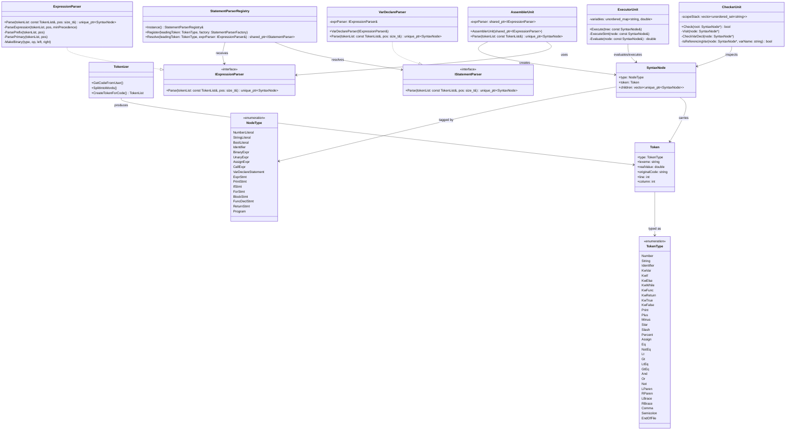
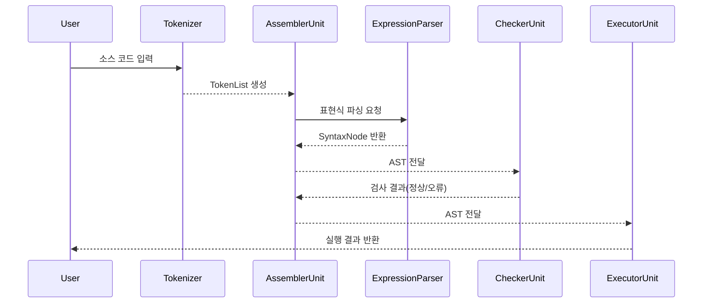
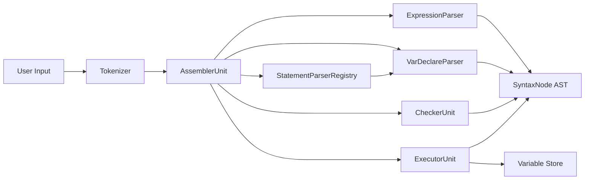

# Design Document: CodeFab Interpreter

## 1. 개요 (Overview)
* **목적**: 팀 전용 Custom Language를 설계하고, 이를 실행하는 인터프리터(CodeFab)를 제작함.
* **동작 방식**: 코드(Script)를 입력받으면 공장(Fab)처럼 파이프라인을 거쳐 실행 결과를 반환함.

## 2. 아키텍처 및 파이프라인
인터프리터는 총 3개의 유닛으로 구성된 파이프라인 구조를 가짐.

* **Assembler Unit**: 소스코드를 토큰화하고, 의미 있는 단위로 가공하여 문법 트리(AST) 조립체를 생성.
* **Checker Unit**: 재귀적 DFS 알고리즘을 사용하여 문법 트리 내 의미론적 오류(중복 선언, 자기 참조 등)를 검출.
* **Executor Unit**: 완성된 문법 트리를 DFS 방식으로 순회하며 실제 로직을 실행하고 결과를 출력.

## 3. 언어 명세 (Language Specification)
* **문장 구분**: 모든 문장은 세미콜론(`;`)으로 종료함.
* **파일 종료**: 코드의 최종 끝(EOF)은 개행 문자(`\n`)로 식별함.
* **문법 구성**: `Expression`(값 생성)과 `Statement`(동작 수행) 노드로 트리 구성.

## 4. 핵심 데이터 구조
* **SyntaxNode**: `NodeType` 필드와 `children`(재귀적 트리 구조) 벡터를 통해 문법 트리를 구성.
* **변수 저장소 (Scope)**:
    * Global 및 Local 스코프로 나뉨.
    * `{}` 블록 진입 시 새 저장소 생성, 종료 시 소멸.
    * 변수 탐색: 인접 스코프부터 Global 스코프까지 상위로 거슬러 올라가며 탐색.

## 5. 주요 로직
* **Checker Unit 알고리즘**:
    * 변수 중복 선언 검사: 현재 블록 내 동일 변수 존재 여부 확인.
    * 초기화 시 자기 참조 검사: `var a = a + 1;`과 같은 선언 시 우항의 식별자 재귀 탐색.
* **Executor Unit 알고리즘**:
    * 재귀 호출을 통한 트리 노드 평가(Evaluate) 및 실행(Execute).

## 6. 테스트 전략
* **개발 방법론**: TDD개발
* **통과 기준**: 제공된 예시 스크립트(Gist 링크)의 문법 및 동작 완벽 수행.

## 7. 향후 계획 (Roadmap)
* **3~4일차**: Function 구현, 정적 배열 구현, 실행 전 최적화 기능 추가.
* **5일차**: 리팩토링 전/후 결과 및 코드 리뷰 활동을 포함한 최종 발표.

## 8. UML 클래스 다이어그램 (현재 구현 기준)
현재 저장소의 실제 구현을 기준으로, 핵심 모듈 간 관계를 Mermaid로 다시 정리한 다이어그램이다.

## 9. 실행 흐름 시퀀스 다이어그램
다음은 소스 코드가 토큰화된 뒤 AST로 조립되고, 검사와 실행을 거쳐 결과를 내는 전체 흐름이다.

## 10. 모듈별 책임 및 의존관계
- Tokenizer: 입력 문자열을 토큰 단위로 분해하고, 이후 파싱 단계가 사용할 토큰 스트림을 제공한다.
- AssemblerUnit: 토큰 목록을 받아 AST를 조립하며, 표현식 파서를 통해 식 노드를 생성한다.
- ExpressionParser: 우선순위와 결합성을 반영해 표현식 트리를 구성한다.
- VarDeclareParser: 변수 선언문을 파싱하며, 초기화식이 있으면 ExpressionParser를 사용한다.
- StatementParserRegistry: 토큰 타입에 맞는 문장 파서를 등록하고, 적절한 파서를 선택해 준다.
- CheckerUnit: 스코프를 관리하면서 중복 선언, 자기 참조와 같은 의미론적 오류를 검사한다.
- ExecutorUnit: AST를 순회하며 변수 상태를 갱신하고 실행 결과를 출력한다.

## 11. 컴포넌트 다이어그램
다음은 런타임에서 각 모듈이 어떤 컴포넌트로 역할을 나누는지를 보여주는 개념적 다이어그램이다.

## 12. 모듈별 API 목록 (현재 구현 기준)

### 1) Tokenizer
- `void GetCodeFromUser()`
- `std::vector<std::string> SplitIntoWords()`
- `TokenList CreateTokenForCode()`
- `bool CanExtendToTwoCharOperator(char c)`
- `bool IsSingleCharPunctuation(char c)`

### 2) AssemblerUnit
- `AssemblerUnit(std::shared_ptr<IExpressionParser> exprParser)`
- `std::unique_ptr<SyntaxNode> Parse(const TokenList& tokenList)`

### 3) CheckerUnit
- `bool Check(SyntaxNode* root)`
- `void Visit(SyntaxNode* node)`
- `void CheckVarDecl(SyntaxNode* node)`
- `bool IsReferencingVar(SyntaxNode* node, const std::string& varName)`

### 4) ExecutorUnit
- `void Execute(const SyntaxNode& tree)`
- `void ExecuteStmt(const SyntaxNode& node)`
- `double Evaluate(const SyntaxNode& node)`

### 5) ExpressionParser
- `std::unique_ptr<SyntaxNode> Parse(const TokenList& tokenList, size_t& pos)`
- `std::unique_ptr<SyntaxNode> ParseExpression(const TokenList& tokenList, size_t& pos, int minPrecedence)`
- `std::unique_ptr<SyntaxNode> ParsePrefix(const TokenList& tokenList, size_t& pos)`
- `std::unique_ptr<SyntaxNode> ParsePrimary(const TokenList& tokenList, size_t& pos)`
- `static std::unique_ptr<SyntaxNode> MakeBinary(NodeType type, Token op, std::unique_ptr<SyntaxNode> left, std::unique_ptr<SyntaxNode> right)`

### 6) VarDeclareParser
- `VarDeclareParser(IExpressionParser& exprParser)`
- `std::unique_ptr<SyntaxNode> Parse(const TokenList& tokenList, size_t& pos)`

### 7) StatementParserRegistry
- `static StatementParserRegistry& Instance()`
- `void Register(TokenType leadingToken, StatementParserFactory factory)`
- `std::shared_ptr<IStatementParser> Resolve(TokenType leadingToken, IExpressionParser& exprParser) const`

### 8) IExpressionParser
- `virtual std::unique_ptr<SyntaxNode> Parse(const TokenList& tokenList, size_t& pos) = 0`

### 9) IStatementParser
- `virtual std::unique_ptr<SyntaxNode> Parse(const TokenList& tokenList, size_t& pos) = 0`

### 10) SyntaxNode / Token
- `SyntaxNode::type`
- `SyntaxNode::token`
- `SyntaxNode::children`
- `Token::type`
- `Token::lexeme`
- `Token::realValue`
- `Token::originalCode`
- `Token::line`
- `Token::column`
