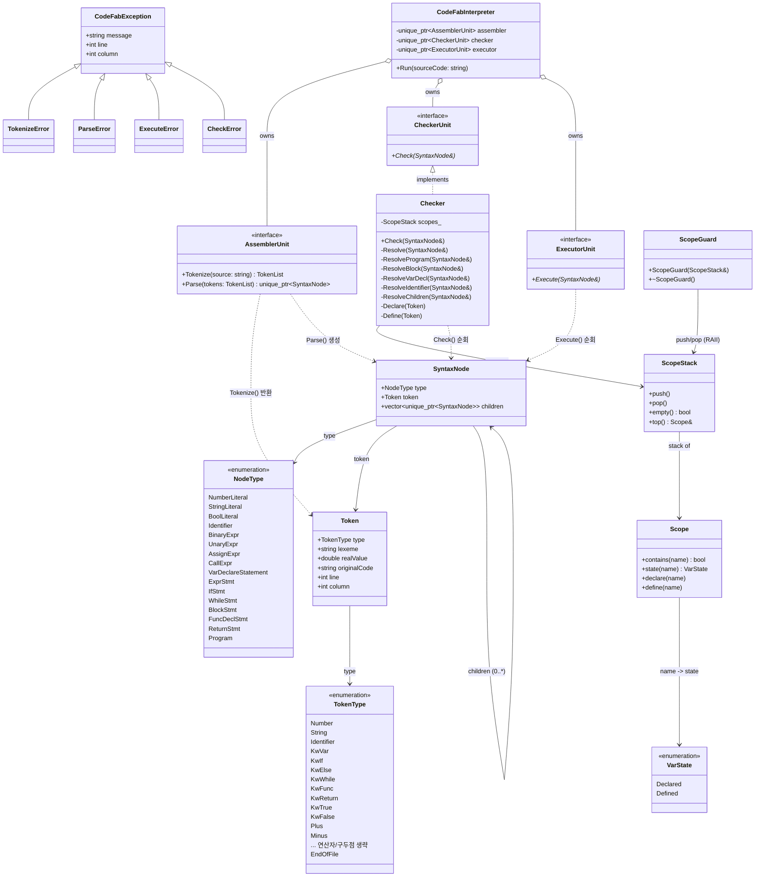

# Design Document: CodeFab Interpreter

## 1. 개요 (Overview)
* **목적**: 팀 전용 Custom Language를 설계하고, 이를 실행하는 인터프리터(CodeFab)를 제작함.
* **동작 방식**: 코드(Script)를 입력받으면 공장(Fab)처럼 파이프라인을 거쳐 실행 결과를 반환함.

## 2. 아키텍처 및 파이프라인
인터프리터는 총 3개의 유닛으로 구성된 파이프라인 구조를 가짐.

* **Assembler Unit**: 소스코드를 토큰화하고, 의미 있는 단위로 가공하여 문법 트리(AST) 조립체를 생성.
* **Checker Unit**: 재귀적 DFS 알고리즘을 사용하여 문법 트리 내 의미론적 오류(중복 선언, 자기 참조 등)를 검출.
* **Executor Unit**: 완성된 문법 트리를 DFS 방식으로 순회하며 실제 로직을 실행하고 결과를 출력.

## 3. 언어 명세 (Language Specification)
* **문장 구분**: 모든 문장은 세미콜론(`;`)으로 종료함.
* **파일 종료**: 코드의 최종 끝(EOF)은 개행 문자(`\n`)로 식별함.
* **문법 구성**: `Expression`(값 생성)과 `Statement`(동작 수행) 노드로 트리 구성.

## 4. 핵심 데이터 구조
* **SyntaxNode**: `NodeType` 필드와 `children`(재귀적 트리 구조) 벡터를 통해 문법 트리를 구성.
* **변수 저장소 (Scope)**:
    * Global 및 Local 스코프로 나뉨.
    * `{}` 블록 진입 시 새 저장소 생성, 종료 시 소멸.
    * 변수 탐색: 인접 스코프부터 Global 스코프까지 상위로 거슬러 올라가며 탐색.

## 5. 주요 로직
* **Checker Unit 알고리즘**:
    * 변수 중복 선언 검사: 현재 블록 내 동일 변수 존재 여부 확인.
    * 초기화 시 자기 참조 검사: `var a = a + 1;`과 같은 선언 시 우항의 식별자 재귀 탐색.
* **Executor Unit 알고리즘**:
    * 재귀 호출을 통한 트리 노드 평가(Evaluate) 및 실행(Execute).

## 6. 테스트 전략
* **개발 방법론**: TDD개발
* **통과 기준**: 제공된 예시 스크립트(Gist 링크)의 문법 및 동작 완벽 수행.

## 7. 향후 계획 (Roadmap)
* **3~4일차**: Function 구현, 정적 배열 구현, 실행 전 최적화 기능 추가.
* **5일차**: 리팩토링 전/후 결과 및 코드 리뷰 활동을 포함한 최종 발표.

## 8. UML 클래스 다이어그램 (현재 src 구조)
`CodeFabInterpreter.h`가 기대하는 계약(`AssemblerUnit`/`CheckerUnit`/`ExecutorUnit`
인터페이스 + `MockUnits.h`의 GoogleMock 대체 가능성)을 기준으로 현재 루트 소스
파일들의 관계를 정리한 다이어그램. `Checker`의 내부 로직은 `docs/Checker.md`,
`SyntaxNode`의 NodeType별 필드 규약은 `docs/SyntaxNode-Contract.md` 참고.

> **참고 (구현 진행 상태)**: 위 다이어그램은 `CodeFabInterpreter.h`/`MockUnits.h`가
> 전제하는 목표 인터페이스 기준이다. 루트의 `AssemblerUnit.h`(비-가상
> `Parse(TokenList)`만 존재, `Tokenize` 없음)와 `CheckerUnit.h`/`CheckerUnit.cpp`
> (`bool Check(SyntaxNode*)`, 자체 스코프 스택 보유)는 아직 이 인터페이스로
> 리팩토링되기 전 구버전이며, `Checker`/`Checker.h`가 신규 계약을 구현한 상태다.
> Assembler/Executor Unit 리팩토링이 완료되면 이 문서를 함께 갱신할 것.