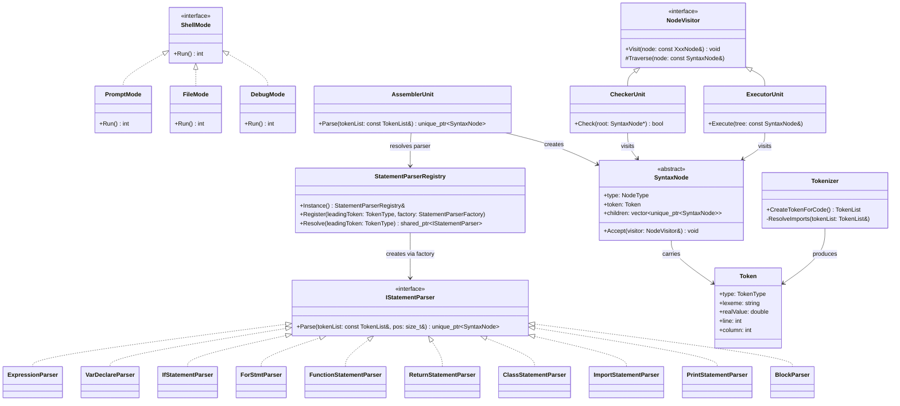
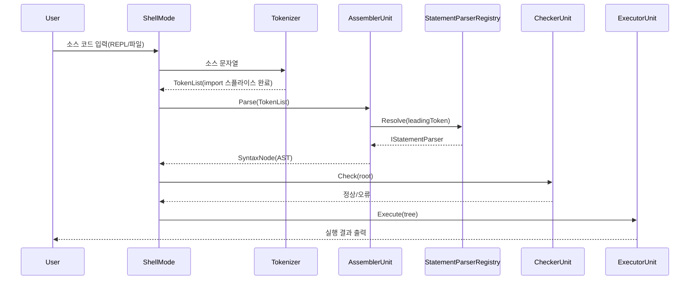

# Design Document: CodeFab Interpreter

> **2026-07-10 전면 개정, 같은 날 재갱신**: 이 문서는 초기 설계(3~4일차 기준)를 그대로 담고 있어 CLAUDE.md가 "outdated"로 지적한 문서였다. 처음 개정 시점에는 Import 실행부(ModuleLoader/alias)와 DebugMode가 아직 미구현이라 11~12절을 "미구현 현황 + 가정 시나리오"로 나눠 적었으나, 같은 날 안에 `bd03407`/`eabc281`(Import alias 네임스페이스)과 `e64dd4f`/`7117b13`(DebugMode Observer 패턴 + StepController + WatchList)이 모두 병합되어 **두 항목 다 실제로 구현 완료됐다**. 11~12절은 이제 "가정"이 아니라 실제 구현을 설명한다.

## 1. 개요 (Overview)
* **목적**: 팀 전용 Custom Language를 설계하고, 이를 실행하는 인터프리터(CodeFab)를 제작함.
* **동작 방식**: 코드(Script)를 입력받으면 공장(Fab)처럼 파이프라인을 거쳐 실행 결과를 반환함.
* **진입점**: `main()`은 `argv`를 보고 세 가지 `ShellMode` 중 하나를 선택해 위임한다 — `PromptMode`(REPL), `FileMode`(`run <file>`), `DebugMode`(`debug <file>`). 각 모드는 자신만의 파이프라인(Tokenizer/AssemblerUnit/CheckerUnit/ExecutorUnit)을 `Run()` 안에서 지역으로 소유하므로 모드 간에 상태를 공유하지 않는다.

## 2. 아키텍처 및 파이프라인
인터프리터는 4개의 유닛이 순서대로 실행되는 파이프라인 구조를 가짐.

* **Tokenizer**: 소스 문자열을 `TokenList`로 분해한다. `import "path" alias x;`를 만나면 `ResolveImports`가 대상 파일을 재귀적으로 읽어 토큰 스트림에 이어붙인다(파일없음/순환 import는 여기서 감지 — 자세한 내용은 `docs/feature_Import_design.md` 참고).
* **Assembler Unit**: 토큰을 문법 트리(AST, `SyntaxNode` 계층)로 조립한다. 특정 파서를 직접 알지 못하며, 첫 토큰 타입으로 `StatementParserRegistry`에서 파서를 `Resolve()`해 위임할 뿐이다(Strategy + Registry 패턴 — 3절).
* **Checker Unit**: 완성된 AST를 `NodeVisitor` 더블 디스패치로 순회하며 의미론적 오류(중복 선언, 자기 참조, 스코프 규칙 위반 등)를 정적으로 검출한다. 파일시스템에는 접근하지 않는다.
* **Executor Unit**: 검사를 통과한 AST를 다시 `NodeVisitor`로 순회하며 실제 로직을 실행하고 결과를 출력한다.

## 3. Assembler Unit 파서 아키텍처: Strategy + Registry

`AssemblerUnit::Parse()`는 statement 타입을 switch/if-else로 직접 분기하지 않는다. 모든 파서는 `IStatementParser` 하나로 통일되어 있고, 전역 싱글턴 `StatementParserRegistry`를 통해 런타임에 필요한 파서를 얻어와 위임한다.

* **`IStatementParser`**: 유일한 파서 인터페이스 — `virtual unique_ptr<SyntaxNode> Parse(const TokenList&, size_t& pos) = 0`.
* **`StatementParserRegistry`**: `TokenType` → factory(`function<shared_ptr<IStatementParser>()>`) 매핑을 가진 전역 싱글턴. `Register()`로 등록, `Resolve()`로 조회. 미등록 토큰은 `nullptr` 반환(예외를 던지지 않음 — 호출자가 문맥에 맞는 `runtime_error`를 던질 책임을 짐).
* **`StatementParserRegistrar<TParser>`**: 파서가 자기 `.cpp`의 익명 namespace에서 스스로 등록하게 하는 템플릿. 여러 leading token(예: `ExpressionParser`는 `Number`/`String`/`Identifier`/`KwTrue`/`KwFalse`/`LParen`/`KwThis`/`KwSuper`/`Minus`/`Not`)에서 시작할 수 있는 파서는 토큰 수만큼 registrar를 선언한다.
* **`AssemblerUnit`**: 생성자가 없다. 어떤 파서가 존재하는지 전혀 모르며(해당 파서의 헤더도 include하지 않음), 첫 토큰으로 `Resolve()`해 위임만 한다. 새 statement를 추가해도 `AssemblerUnit`을 수정할 필요가 없다(Open-Closed Principle).

현재 등록된 파서(leading token → 파서):

| Leading Token | Parser |
|---|---|
| `KwVar` | `VarDeclareParser` |
| `KwIf` | `IfStatementParser` |
| `KwFor` | `ForStmtParser` |
| `KwFunc` | `FunctionStatementParser` |
| `KwReturn` | `ReturnStatementParser` |
| `KwClass` | `ClassStatementParser` |
| `KwImport` | `ImportStatementParser` |
| `Print` | `PrintStatementParser` |
| `LBrace` | `BlockParser` |
| `Number`/`String`/`Identifier`/`KwTrue`/`KwFalse`/`LParen`/`KwThis`/`KwSuper`/`Minus`/`Not` | `ExpressionParser` |

## 4. 언어 명세 (Language Specification)
* **문장 구분**: 모든 문장은 세미콜론(`;`)으로 종료함(블록 `{}`은 예외).
* **문법 구성**: `Expression`(값 생성)과 `Statement`(동작 수행) 노드로 트리 구성.
* **지원 기능**: 변수 선언(`var`), 산술/비교/논리 연산자, 문자열 리터럴, 분기(`if`/`else`), 반복(`for`), 함수 선언/호출/`return`, 고정 크기 배열(`Arr(n)`/`arr[i]`), 클래스(`Class`/`this`/`Super`/`.`/`instanceof`), `print`, `import ... alias ...;`(실행부는 11절 참고).

## 5. 핵심 데이터 구조

### 5.1 SyntaxNode: GoF Visitor 패턴
`SyntaxNode`는 추상 베이스라 값으로도, `make_unique<SyntaxNode>()`로도 만들 수 없다. `type`/`token`/`children`은 그대로 갖되, 순수가상함수 `Accept(NodeVisitor&) const`를 가지며, `NodeType`마다 존재하는 구체 서브클래스(`NumberLiteralNode`, `VarDeclareStatementNode`, `ClassDeclStmtNode`, `ImportStmtNode`, `ProgramNode` 등)가 생성자에서 `type`을 스스로 채우고 `Accept()`에서 `visitor.Visit(*this)`를 호출해(더블 디스패치) 자기 정확한 타입을 되돌려준다.

`NodeVisitor`는 `NodeType` 값마다 하나씩 `virtual void Visit(const XxxNode&)`를 선언한 인터페이스다. 기본 구현(`NodeVisitor.cpp`)은 `Traverse(node)`로 자식을 그대로 순회하는 것이므로, `CheckerUnit`/`ExecutorUnit` 같은 구체 Visitor는 **관심 있는 노드 타입만 override**하면 된다.

현재 `NodeType`:

```
// expression
NumberLiteral, StringLiteral, BoolLiteral, Identifier,
BinaryExpr, UnaryExpr, AssignExpr, CallExpr,
ArrExpr, IndexExpr, ThisExpr, SuperExpr, MemberAccessExpr,

// statement
VarDeclareStatement, ExprStmt, PrintStmt, IfStmt, ForStmt,
BlockStmt, FuncDeclStmt, ReturnStmt, ClassDeclStmt, ImportStmt,

Program
```

값을 반환해야 하는 Visitor(예: `ExecutorUnit`의 식 평가)는 `Visit()`이 `void`이므로 `lastValue` 멤버에 결과를 담아두고, `Evaluate(node)`가 `node.Accept(*this)` 호출 직후 `lastValue`를 읽어 반환하는 out-parameter 패턴을 쓴다.

### 5.2 Token / TokenType

```
Number, String, Identifier,
KwVar, KwIf, KwElse, KwFor, KwFunc, KwReturn, KwTrue, KwFalse, Print,
KwClass, KwThis, KwSuper, KwInstanceof, KwImport, KwAlias,
Plus, Minus, Star, Slash, Percent, Assign, Eq, NotEq, Lt, Gt, LtEq, GtEq, And, Or, Not,
LParen, RParen, LBrace, RBrace, LBracket, RBracket, Comma, Semicolon, Dot, Colon,
EndOfFile
```

`Token`은 `type`/`lexeme`/`realValue`/`originalCode`/`line`/`column`을 가진다.

### 5.3 런타임 값 (`Value_t`)
`ExecutorUnit`은 `std::variant<double, std::string, bool, shared_ptr<FunctionObject>, std::monostate, shared_ptr<ArrayObject>, shared_ptr<InstanceObject>>`를 값 타입으로 쓴다. `ArrayObject`/`InstanceObject`는 `shared_ptr`로 다뤄 대입/전달 시 값 복사가 아니라 참조 의미를 갖는다(배열/인스턴스 공유 시맨틱).

### 5.4 변수 저장소 (Scope)
* `ExecutorUnit::scopes`는 `vector<unordered_map<string, Value_t>>`이며 `scopes[0]`이 Global, 이후가 `BlockStmt` 진입마다 추가되는 Local 스코프.
* `IdentifierNode::scopeDistance`: `CheckerUnit`이 정적 검사 단계에서 미리 계산해두는, 선언 스코프까지의 홉 수. `-1`이면 미해결이며 `ExecutorUnit`은 이 경우 기존 동적(선형) 탐색으로 폴백한다.
* `BinaryExprNode`/`UnaryExprNode`의 `isConstantFolded`/`foldedValue`: `CheckerUnit`이 컴파일 타임에 미리 계산해두는 상수 폴딩 결과.

## 6. 주요 로직

### 6.1 CheckerUnit 알고리즘
`NodeVisitor`를 상속해 관심 있는 `Visit()`만 override한다. 스코프 스택(`scopeStack`), 함수 시그니처 스택(`functionScopeStack`), 클래스 상속 관계 스택(`classScopeStack`), 스코프별 import 파일 집합(`importScopeStack`)을 나란히 관리하며 `EnterScope()`/`ExitScope()`로 push/pop한다.

* 변수/함수/클래스 중복 선언 검사(현재 블록 기준).
* 초기화 시 자기 참조 검사(`var a = a + 1;`).
* 함수 호출 시그니처(인자 개수) 검사, `return`이 함수/메서드 내부에서만 쓰였는지 검사.
* 배열(`Arr`/`[]`) 리터럴 기반 정적 검사 — 값 흐름(변수에 배열이 대입됐는지 등)은 추적하지 않고, 리터럴만으로 100% 확정 가능한 오류만 잡는다(나머지는 `ExecutorUnit`이 실행 시점에 처리).
* `this`/`Super`가 클래스 메서드 본문 내부에서만, `Super`는 부모가 있는 클래스에서만 쓰였는지 검사(`classMethodDepth`/`classHasParentStack`).
* 같은/상위 스코프 중복 import, alias 이름 충돌, 반복문(`for`) 내부 import 사용 금지 검사(`importScopeStack`/`loopDepth`) — 상세는 `docs/feature_Import_design.md` 3.2절.
* 상수 폴딩(`TryGetConstantValue`): 리터럴/이미 폴딩된 상수식을 컴파일 타임에 계산해 노드에 캐싱.

### 6.2 ExecutorUnit 알고리즘
`NodeVisitor`를 상속해 실행이 필요한 노드만 override한다. 문(statement)은 실행 후 값을 반환하지 않고, 식(expression)은 결과를 `lastValue`에 남긴다.

* 스코프/실행 컨텍스트 복구는 전부 RAII 가드(`ScopeGuard`, `MethodContextGuard`, `FunctionCallFrameGuard`)로 처리한다 — 정상 종료/`return`(내부적으로 `ReturnSignal` 예외)/그 외 예외 세 경로 모두에서 스코프가 반드시 원상복구되도록 보장한다(과거 예외 발생 시 스코프가 leak되던 버그의 재발 방지).
* 클래스: `classes`(이름 → 부모 이름 + 메서드 맵)에 등록하고, `InstantiateClass`/`InvokeMethod`/`FindMethod`(부모 방향 탐색, `Super` 호출 지원)/`IsInstanceOf`로 인스턴스 생성·메서드 호출·상속을 실행한다.
* 배열: `ArrayObject`를 실행 시점에 생성하고, `ResolveIndexElement`가 읽기(`EvaluateIndexExpr`)/쓰기(`EvaluateAssignExpr`) 양쪽에서 공유하는 경계·타입 검사를 수행한다.
* 변수 조회: `ResolveVariable(name, distance, line)`이 `CheckerUnit`이 계산해둔 `scopeDistance`를 우선 쓰고, 미해결(`-1`)이면 동적 탐색으로 폴백한다.

## 7. ShellMode: 실행 진입점 전략 패턴

`main()`은 `argv` 형태로 어떤 `ShellMode`(`PromptMode`=REPL, `FileMode`=`run <file>`, `DebugMode`=`debug <file>`)로 들어갈지만 결정한다. 각 모드는 `ShellMode::Run()` 하나만 구현하며, 자신의 파이프라인을 지역으로 소유한다.

* **PromptMode**: 사용자가 소스를 한 줄씩 입력하는 대화형 REPL. `ExecutorUnit`(전역 변수 저장소)은 세션 종료 전까지 유지된다.
* **FileMode**: `.txt` 소스 파일 전체를 한 번에 읽어 실행한다.
* **DebugMode**: `step/next/break/breakpoints/remove/continue/watch/unwatch/watches/inspect`를 전부 지원한다(11절 참고). `ExecutorUnit`이 디버깅 개념을 몰라도 되도록 Observer 패턴으로 분리되어 있다 — `DebugSession`이 `ExecutionObserver`를 구현해 `ExecutorUnit::SetObserver`로 등록되고, `ExecutorUnit::ExecuteStmt`가 문(statement) 진입/이탈마다 `OnStmtEnter`/`OnStmtExit`를 통보한다. "언제 멈출지"는 `StepController`(Step/Next/Continue 모드 + breakpoint 집합), "멈췄을 때 뭘 보여줄지"는 `WatchList`(watch/unwatch/watches/inspect)가 각각 담당하며, `DebugSession`은 이 둘을 오케스트레이션하고 명령 문자열을 라우팅하는 역할만 한다.

## 8. 테스트 전략
* **1단계(완료)**: TDD로 각 모듈 API를 유닛 테스트 수준까지 검증. 다른 파서 의존성은 `MockStatementParser`(gmock)로 stub해서 격리 검증(CLAUDE.md 3절 패턴).
* **2단계(진행 중)**: System test — 콘솔에 입력하는 코드에 대한 최종 실행 결과(유닛이 아니라 end-to-end)를 검증. 신규 기능은 TDD 대신 이 방식으로 바로 검증하며 개발한다. 단, 기존 유닛 테스트(TC)는 살아있는 회귀 테스트이므로 커밋 전 전체 스위트가 PASS하는지 항상 확인한다.

## 9. UML 클래스 다이어그램 (현재 구현 기준)



## 10. 실행 흐름 시퀀스 다이어그램



## 11. Import 실행부 — ModuleObject 기반 네임스페이스

`ImportStatementParser`가 `import "경로" alias 별칭;`을 파싱하고, `CheckerUnit`이 alias 충돌/중복 import/반복문 내부 금지를 검사하는 데 더해, **`ExecutorUnit`도 실제로 `Visit(const ImportStmtNode&)`를 구현한다** — `math.add(1, 2)` 같은 alias 네임스페이스 멤버 접근이 실제로 동작한다.

* **Tokenizer 스플라이스 + `ImportEnd` 경계 마커**: `Tokenizer::ResolveImports`는 여전히 대상 파일의 토큰을 `import ...;` 문 뒤에 이어붙이지만, 그 끝에 `ImportEnd` 마커 토큰을 심는다.
* **`ImportStatementParser`**: `import ... alias X;`의 5개 토큰을 파싱한 뒤, `ImportEnd` 마커를 만날 때까지 이어지는 문장들을 계속 파싱해 `ImportStmtNode`의 자식(`children[2:]`)으로 흡수한다 — 스플라이스된 선언들이 더 이상 전역 최상위 토큰이 아니라 `ImportStmtNode` 아래에 있다. 이 과정에서 import 대상 파일에 선언(함수/전역 변수/import) 외의 구문이 있으면 무시한다.
* **`ExecutorUnit::Visit(const ImportStmtNode&)`**: 흡수된 하위 선언들을 별도 스코프에서 실행해 함수/전역 변수를 수집한 뒤, `ModuleObject`(alias 이름 → export 맵)로 감싸 alias 식별자를 **현재 스코프에만** 바인딩한다. alias 없이는 그 이름이 보이지 않는다(네임스페이스 격리).
* `MemberAccessExprNode`의 대상이 `ModuleObject`이면 export 맵에서 이름을 찾아 호출/참조한다 — 클래스 인스턴스의 `.` 접근과 코드 경로를 공유하되, 대상 타입으로 분기한다.
* 파일없음/순환 import는 여전히 `Tokenizer`가 가장 먼저 잡는다(2절 책임 분담 표는 유지). 자세한 배경/변천사는 `docs/feature_Import_design.md`.

## 12. DebugMode — Observer 패턴 기반 Stmt 단위 stepping

7절에서 요약한 대로, `DebugMode`는 이제 실제로 동작한다.

* **`ExecutionObserver`**: Stmt 실행 경계(`OnStmtEnter`/`OnStmtExit`) 이벤트를 구독하는 인터페이스. `ExecutorUnit::SetObserver`로 등록하며, observer가 `nullptr`이면(PromptMode/FileMode) 기존 동작에 변화가 없다.
* **`StepController`**: "언제 멈출지"만 담당. `Mode`(`Stepping`/`SteppingOver`/`Running`) + breakpoint 집합을 들고 있으며, `ShouldPause(line, depth)`가 현재 모드 기준으로 정지 여부를 판단한다 — `Stepping`은 항상 정지, `SteppingOver`는 depth가 `stepOverDepth` 이하로 돌아올 때까지 정지 보류, `Running`은 breakpoint 라인에서만 정지.
* **`WatchList`**: "멈췄을 때 뭘 보여줄지"만 담당. 등록된 이름을 `executor.TryGetVariable`/`CurrentScope`로 조회해 스코프 표시(`[LOCAL]`/`[GLOBAL]`)와 함께 값+타입을 출력한다. `inspect`는 watch 목록과 무관하게 현재 스코프의 변수 전부를 같은 포맷으로 보여준다.
* **`DebugSession`**: `ExecutionObserver`를 구현하는 오케스트레이터. `OnStmtEnter`에서 `stepController.ShouldPause()`가 참이면 현재 줄을 출력하고 명령 프롬프트로 진입, `step`/`next`/`continue`/`break <line>`/`remove <line>`/`breakpoints`/`watch <var>`/`unwatch <var>`/`watches`/`inspect`/`exit`(`quit`) 명령을 라우팅한다.

## 13. 향후 개선 방향

- `ExecutorUnit`이 여전히 클래스/함수/배열/import/디버그 훅 등 여러 책임을 한 클래스에 갖고 있다 — 장기적으로 `Environment`/`FunctionRuntime`/`ClassRuntime`/`ModuleLoader` 분리를 고려할 수 있다.
- 회귀 테스트 공백: 함수 파라미터 이름 중복, `this.메서드()` 체이닝 전용 테스트가 없다(기능 자체는 동작).
- import 대상 파일의 "선언 외 구문 무시" 정책이 실행 시점에만 있고 `CheckerUnit` 레벨의 명시적 검증은 없다.
