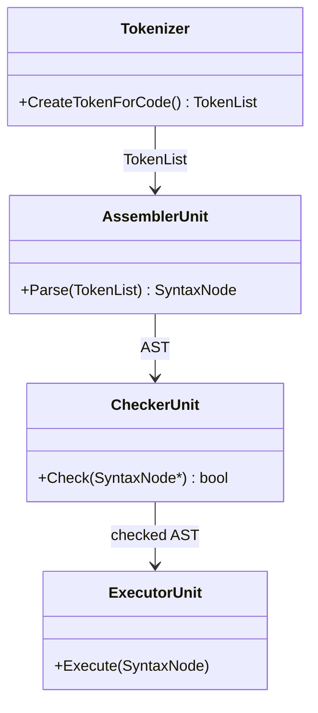
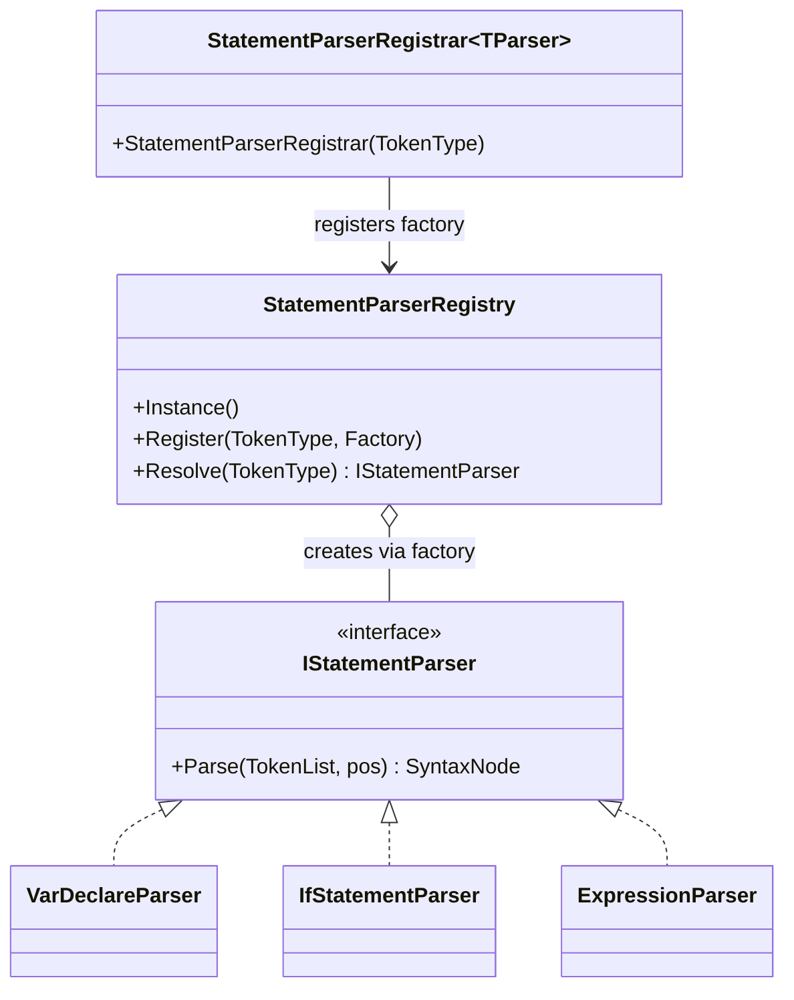
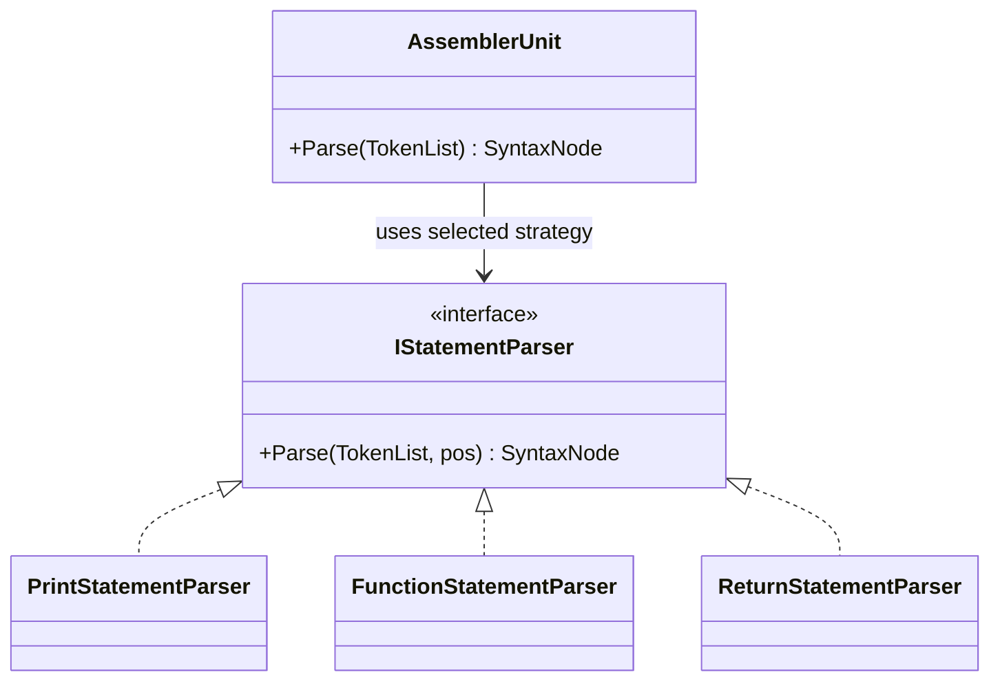
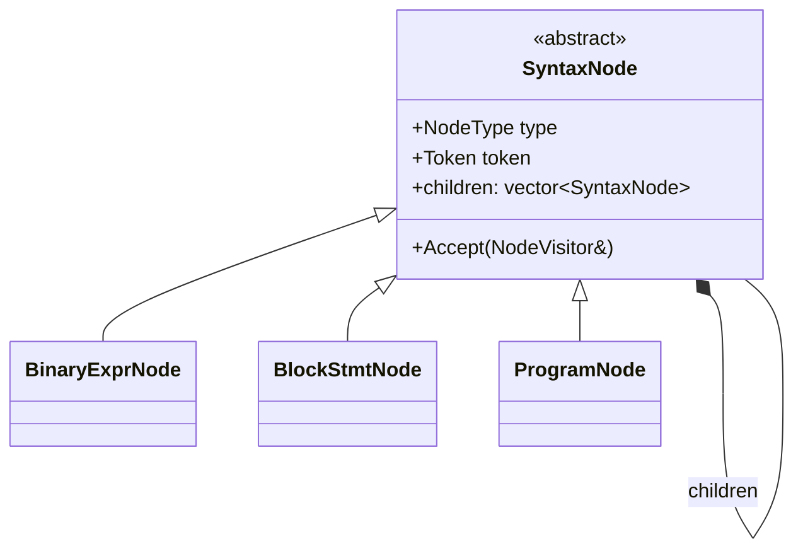
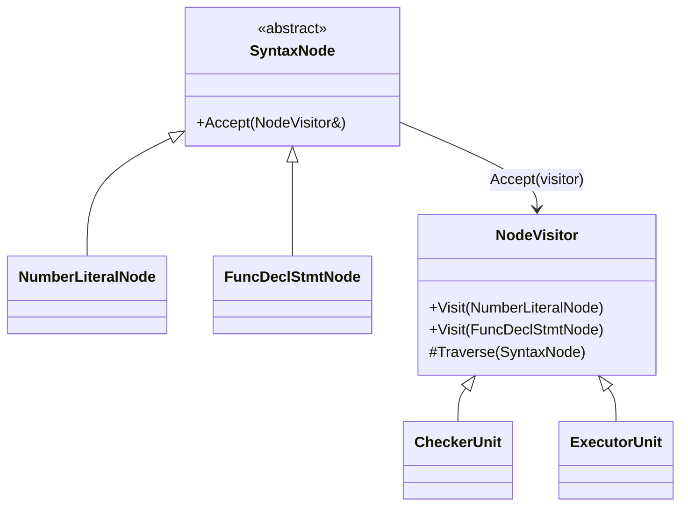
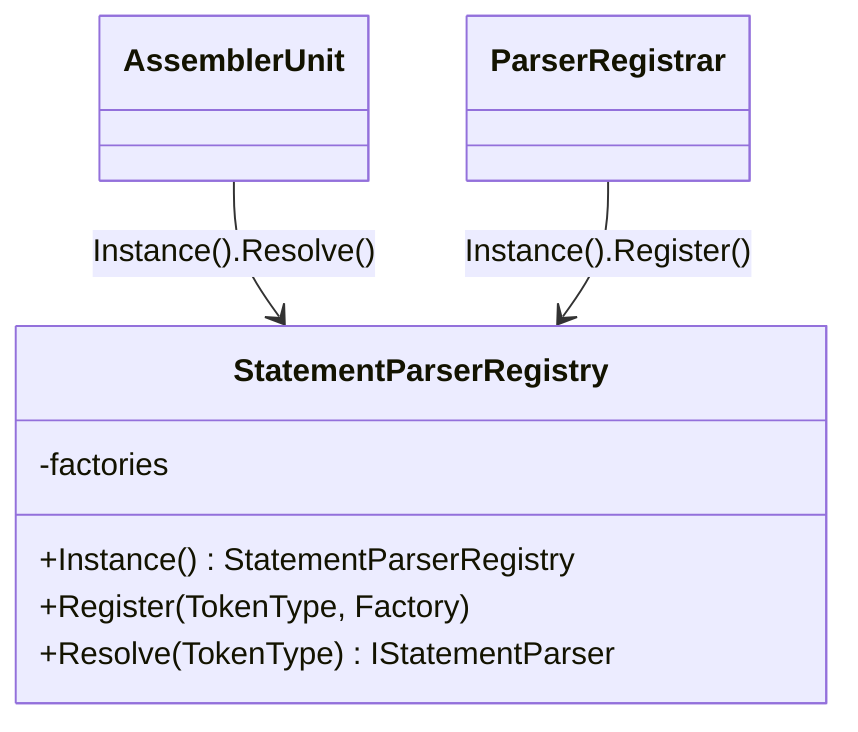
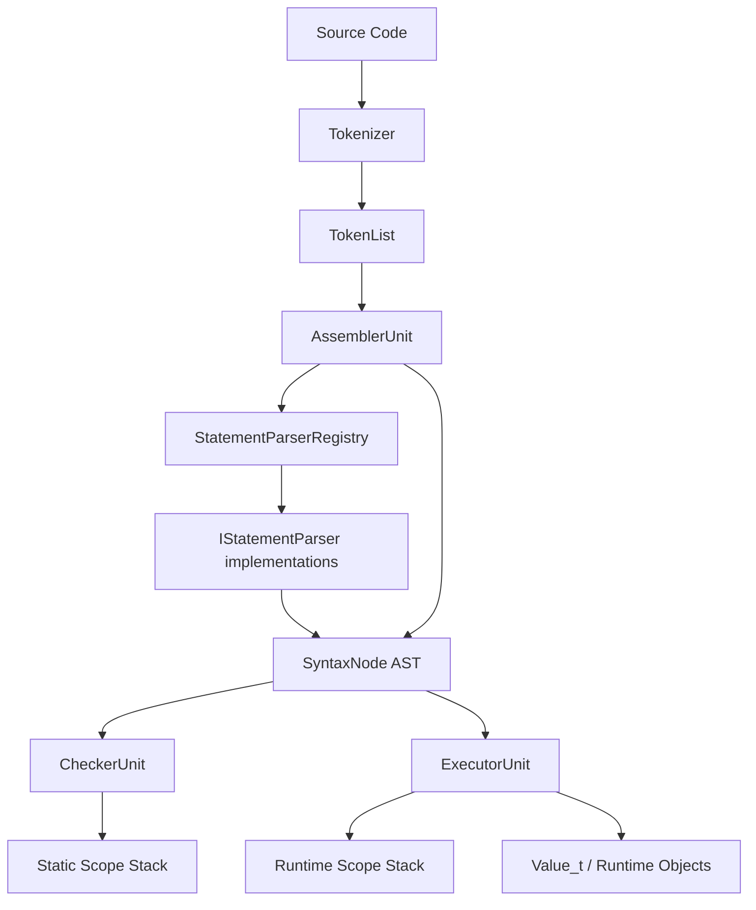
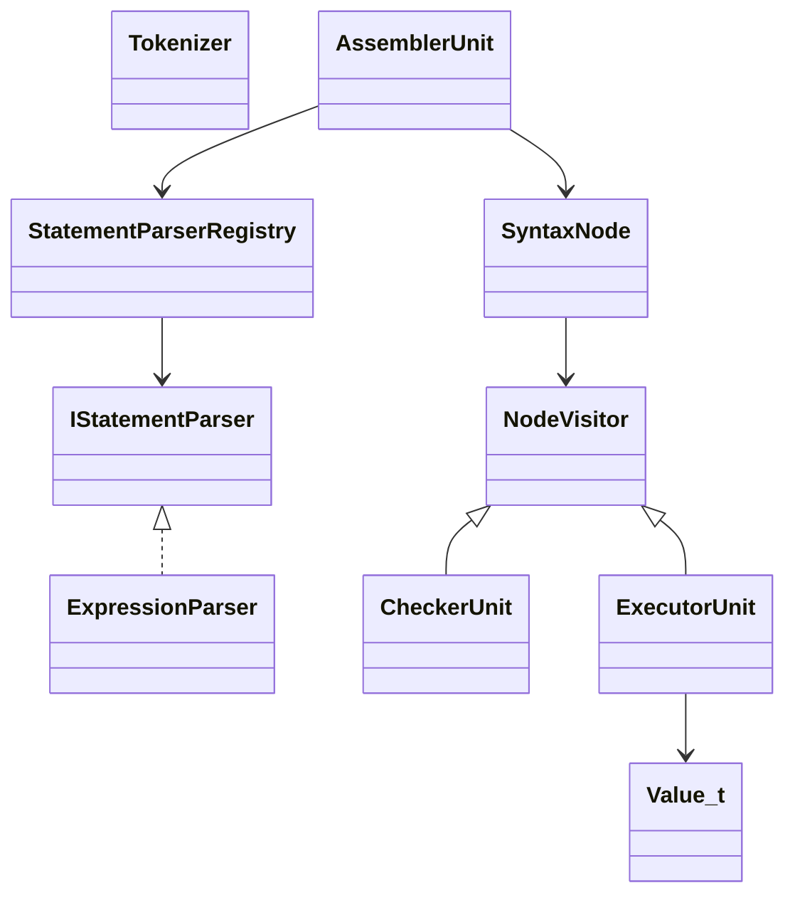

# CodeFab SW Design Presentation

## 1. 발표 목적

CodeFab는 팀 전용 Custom Language를 실행하기 위한 C++ 기반 인터프리터이다. 이번 발표의 목적은 현재 코드베이스의 전체 구조를 SW 설계 관점에서 설명하고, 적용된 디자인 패턴과 클래스 간 책임 분리를 정리하는 것이다.

핵심 메시지:

- CodeFab는 `Tokenizer -> Parser -> Checker -> Executor`로 이어지는 인터프리터 파이프라인 구조를 가진다.
- Parser는 `StatementParserRegistry`와 `IStatementParser` 기반으로 확장 가능하게 구성되어 있다.
- AST는 `SyntaxNode` 계층과 `children` 기반 Composite 구조로 표현된다.
- Checker와 Executor는 `NodeVisitor`를 통해 같은 AST를 서로 다른 목적의 pass로 순회한다.

## 2. 전체 실행 파이프라인

```text
Source Code
  -> Tokenizer
  -> AssemblerUnit
  -> StatementParserRegistry
  -> StatementParser / ExpressionParser
  -> SyntaxNode AST
  -> CheckerUnit
  -> ExecutorUnit
  -> Runtime Result
```

각 단계의 책임:

- `Tokenizer`: 입력 문자열을 `TokenList`로 변환한다.
- `AssemblerUnit`: `TokenList`를 순회하며 `ProgramNode` AST를 만든다.
- `StatementParserRegistry`: 현재 토큰을 처리할 parser를 선택한다.
- `ExpressionParser`: 연산자 우선순위와 결합성을 반영해 expression AST를 만든다.
- `CheckerUnit`: AST 기반 의미 검사를 수행하고 일부 정적 정보를 AST에 기록한다.
- `ExecutorUnit`: AST를 실행하며 runtime scope와 value를 관리한다.

## 3. 주요 모듈 책임

| 모듈 | 책임 |
|---|---|
| `Tokenizer` | 문자열 입력을 토큰 단위로 분해 |
| `AssemblerUnit` | 토큰 스트림을 statement 단위로 AST에 조립 |
| `StatementParserRegistry` | `TokenType`에 맞는 parser factory 관리 |
| `IStatementParser` | statement parser 공통 인터페이스 |
| `ExpressionParser` | Pratt/precedence climbing 기반 expression parsing |
| `SyntaxNode` | AST 노드 공통 기반 클래스 |
| `NodeVisitor` | AST 순회 동작의 공통 인터페이스 |
| `CheckerUnit` | 의미 검사, scope 검사, 정적 바인딩, 상수 폴딩 |
| `ExecutorUnit` | AST 실행, runtime value/scope/class/function 처리 |

## 4. Parser 설계

Parser 계층은 `AssemblerUnit`과 `StatementParserRegistry`를 중심으로 동작한다.

```text
AssemblerUnit
  -> tokenList[pos].type 확인
  -> StatementParserRegistry::Resolve(tokenType)
  -> IStatementParser::Parse(tokenList, pos)
  -> SyntaxNode 반환
```

Statement parser 예:

- `VarDeclareParser`
- `PrintStatementParser`
- `IfStatementParser`
- `ForStmtParser`
- `BlockParser`
- `FunctionStatementParser`
- `ReturnStatementParser`
- `ExpressionParser`

설계 장점:

- statement 종류별 parser가 분리되어 있다.
- 새 statement 추가 시 parser 파일과 registry 등록만 추가하면 된다.
- `AssemblerUnit`은 구체 parser 클래스를 직접 알 필요가 없다.

설계 주의점:

- `ExpressionParser`가 expression parser이면서 expression statement parser 역할도 한다.
- parser마다 세미콜론 소비 여부가 다르기 때문에 `AssemblerUnit`과 `BlockParser`가 trailing semicolon을 보정한다.

## 5. AST 설계

AST는 `SyntaxNode` 추상 클래스와 구체 노드 계층으로 구성된다.

```text
SyntaxNode
  - NodeType type
  - Token token
  - vector<unique_ptr<SyntaxNode>> children
  - Accept(NodeVisitor&)
```

대표 노드:

- Expression: `NumberLiteralNode`, `IdentifierNode`, `BinaryExprNode`, `UnaryExprNode`, `AssignExprNode`, `CallExprNode`
- Statement: `VarDeclareStatementNode`, `PrintStmtNode`, `IfStmtNode`, `ForStmtNode`, `BlockStmtNode`, `FuncDeclStmtNode`, `ReturnStmtNode`
- Runtime language feature: `ArrExprNode`, `IndexExprNode`, `ClassDeclStmtNode`, `MemberAccessExprNode`, `ThisExprNode`, `SuperExprNode`

AST node shape 예:

| 노드 | children 의미 |
|---|---|
| `BinaryExprNode` | `[left, right]` |
| `AssignExprNode` | `[target, value]` |
| `IndexExprNode` | `[arrayExpr, indexExpr]` |
| `IfStmtNode` | `[condition, thenBranch, optionalElseBranch]` |
| `ForStmtNode` | `[init, condition, increment, body]` |
| `FuncDeclStmtNode` | `[param..., body]` |
| `BlockStmtNode` | `[statement...]` |

설계 주의점:

- `children[index]`의 의미가 노드 타입별 암묵적 contract로 존재한다.
- 문서에 node shape table을 유지하지 않으면 Parser, Checker, Executor 간 계약이 흐려질 수 있다.

## 6. Visitor 기반 Pass 구조

`CheckerUnit`과 `ExecutorUnit`은 `NodeVisitor`를 상속한다. 각 `SyntaxNode`는 `Accept()`에서 자기 타입에 맞는 `Visit()`을 호출한다.

```text
node->Accept(visitor)
  -> visitor.Visit(concreteNode)
```

이 구조는 double dispatch를 사용한다.

장점:

- `switch (node.type)` 중심 분기를 줄인다.
- 같은 AST를 여러 pass가 서로 다른 목적으로 순회할 수 있다.
- `CheckerUnit`과 `ExecutorUnit`의 관심사를 분리한다.

단점:

- 새 노드 타입 추가 시 `SyntaxNode`, `NodeVisitor`, 관련 Visitor 구현을 함께 수정해야 한다.
- `NodeType enum`과 구체 클래스가 함께 존재해 타입 정보가 중복된다.

## 7. CheckerUnit 설계

`CheckerUnit`은 단순 validator가 아니라 semantic analysis pass에 가깝다.

주요 책임:

- 변수 중복 선언 검사
- 자기 초기화 참조 검사
- 함수 파라미터 중복 검사
- return 위치 검사
- this/super 사용 위치 검사
- class 상속 규칙 검사
- 배열/인덱스 일부 정적 검사
- identifier 정적 바인딩 거리 기록
- constant folding 결과 기록

중요한 특징:

```text
CheckerUnit은 AST를 읽기만 하지 않고, 일부 노드에 정적 분석 결과를 기록한다.
```

예:

- `IdentifierNode::scopeDistance`
- `BinaryExprNode::isConstantFolded`
- `BinaryExprNode::foldedValue`
- `UnaryExprNode::isConstantFolded`
- `UnaryExprNode::foldedValue`

설계상 의미:

- Checker는 “검사기”와 “AST annotation pass”의 역할을 함께 가진다.
- Executor는 Checker가 기록한 정보를 활용할 수 있다.

## 8. ExecutorUnit 설계

`ExecutorUnit`은 runtime execution pass이다.

주요 책임:

- statement 실행
- expression 평가
- runtime scope stack 관리
- 변수 선언/대입/조회
- 배열 생성과 인덱싱
- 함수/return 처리
- 클래스 선언, 인스턴스 생성, 필드 접근
- method call, `this`, `Super`, `instanceof` 처리
- 출력 처리

Runtime value model:

```text
Value_t =
  double
  string
  bool
  shared_ptr<FunctionObject>
  monostate
  shared_ptr<ArrayObject>
  shared_ptr<InstanceObject>
```

참조 의미:

- `ArrayObject`는 `shared_ptr`로 관리되어 변수 대입 시 같은 배열 저장소를 공유한다.
- `InstanceObject`도 `shared_ptr`로 관리되어 여러 변수가 같은 인스턴스를 참조할 수 있다.

설계 주의점:

- `ExecutorUnit`은 기능이 많아질수록 God Object가 될 위험이 있다.
- 장기적으로 `Environment`, `FunctionRuntime`, `ClassRuntime`, `ValuePrinter` 같은 책임 분리가 가능하다.

## 9. 적용된 디자인 패턴

| 패턴 | 적용 위치 | 설명 |
|---|---|---|
| Pipeline | 전체 구조 | Tokenize -> Parse -> Check -> Execute |
| Registry | `StatementParserRegistry` | `TokenType`별 parser factory 등록/조회 |
| Factory | `StatementParserRegistrar` | parser 객체 생성 책임 캡슐화 |
| Strategy | `IStatementParser` 구현체들 | statement 종류별 parsing strategy |
| Composite | `SyntaxNode::children` | AST를 트리 구조로 표현 |
| Visitor | `NodeVisitor`, `CheckerUnit`, `ExecutorUnit` | AST 노드별 동작 분리 |
| Singleton | `StatementParserRegistry::Instance()` | parser registry 전역 접근 |

### 9.1 Pipeline Pattern



의도:

- 각 단계가 이전 단계의 산출물을 입력으로 받는다.
- 문법 오류, 의미 오류, 런타임 오류의 위치를 단계별로 분리한다.

### 9.2 Registry + Factory Pattern



의도:

- `AssemblerUnit`이 구체 parser를 직접 알지 않아도 된다.
- 새 statement parser는 registry 등록만으로 추가할 수 있다.

### 9.3 Strategy Pattern



의도:

- 문장 종류별 parsing algorithm을 parser 클래스별로 분리한다.
- `AssemblerUnit`은 공통 인터페이스만 호출한다.

### 9.4 Composite Pattern



의도:

- AST 전체를 동일한 `SyntaxNode` 트리로 표현한다.
- 모든 노드는 공통적으로 `children`을 통해 하위 노드를 소유한다.

### 9.5 Visitor Pattern



의도:

- AST 구조와 AST에 대한 동작을 분리한다.
- `CheckerUnit`과 `ExecutorUnit`이 같은 AST를 다른 목적으로 순회한다.

### 9.6 Singleton Pattern



의도:

- parser registry를 전역에서 하나만 유지한다.
- 각 parser cpp의 static registrar가 같은 registry에 자신을 등록한다.

## 10. 클래스 상호 관계 요약





## 11. 현재 설계의 장점

- Parser, Checker, Executor의 책임이 큰 단계 기준으로 분리되어 있다.
- statement parser가 분리되어 문법 확장이 비교적 쉽다.
- Visitor 기반으로 Checker와 Executor가 같은 AST를 공유하면서도 동작은 분리된다.
- `Value_t` 기반 runtime value 모델로 여러 타입을 한 경로에서 다룰 수 있다.
- 단위 테스트가 Tokenizer, Parser, Checker, Executor별로 나뉘어 있다.
- 정적 바인딩과 상수 폴딩을 Checker 단계에서 처리해 Executor의 반복 계산을 줄일 수 있다.

## 12. 현재 설계의 한계

### 12.1 ExpressionParser 역할 혼합

`ExpressionParser`가 expression parser와 expression statement parser 역할을 동시에 수행한다.

영향:

- 세미콜론 처리 책임이 애매하다.
- `AssemblerUnit`과 `BlockParser`에 trailing semicolon 보정 로직이 필요하다.

개선 방향:

- `ExpressionParser`: expression만 parse
- `ExpressionStatementParser`: expression을 statement로 감싸고 `;` 처리

### 12.2 AST children index contract

노드별 child 순서가 코드 convention에 의존한다.

영향:

- Parser, Checker, Executor가 같은 순서를 알고 있어야 한다.
- 새 기능 추가 시 index 실수 가능성이 높다.

개선 방향:

- 단기: 문서에 AST node shape table 유지
- 장기: 노드별 명시 필드 도입

### 12.3 ExecutorUnit 책임 집중

`ExecutorUnit`이 런타임 대부분의 책임을 가진다.

영향:

- 클래스/함수/배열/import 같은 기능이 늘면 변경 범위가 커진다.
- 테스트와 리팩토링 비용이 증가한다.

개선 방향:

- `Environment` 또는 `ScopeStack` 분리
- `FunctionRuntime` 분리
- `ClassRuntime` 분리
- `ModuleLoader` 분리
- `ValuePrinter` 분리

### 12.4 Singleton Registry 테스트 오염 가능성

`StatementParserRegistry`는 전역 singleton이다.

영향:

- 테스트에서 mock parser 등록 후 원복하지 않으면 다른 테스트에 영향을 줄 수 있다.
- parser 등록 순서와 static initialization에 민감할 수 있다.

개선 방향:

- `ResetForTest()` 제공
- `AssemblerUnit`에 registry 주입
- `ParserContext` 도입

### 12.5 Error Type 미분리

현재 오류는 대체로 `std::runtime_error`에 의존한다.

영향:

- parse error, semantic error, runtime error를 타입으로 구분하기 어렵다.
- 테스트가 메시지 substring에 의존한다.

개선 방향:

- `ParseError`
- `SemanticError`
- `RuntimeError`
- `ImportError`

## 13. 향후 리팩토링 방향

우선순위:

1. `ExpressionStatementParser` 분리
2. AST node shape table 문서화
3. `Environment` / `ScopeStack` 분리
4. `ExecutorUnit`에서 function/class/module runtime 분리
5. `StatementParserRegistry` 테스트 안정성 개선
6. error type 계층 도입
7. 설계 문서와 실제 코드 API 동기화

## 14. 발표 결론

CodeFab는 작은 인터프리터지만, 이미 compiler/interpreter에서 자주 쓰는 구조를 갖추고 있다.

- Pipeline으로 전체 실행 흐름을 분리했다.
- Registry와 Strategy로 parser 확장성을 확보했다.
- Composite로 AST를 표현했다.
- Visitor로 semantic check와 runtime execution pass를 분리했다.

현재 가장 중요한 설계 과제는 `ExecutorUnit` 책임 집중과 `ExpressionParser` 역할 혼합을 줄이는 것이다. 이 두 지점을 정리하면 CodeFab는 이후 import, class, function 같은 기능 확장에도 더 안정적인 구조를 가질 수 있다.
