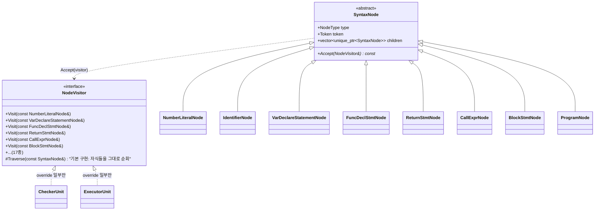
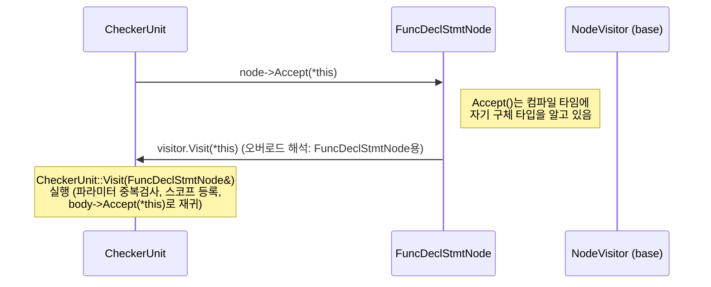
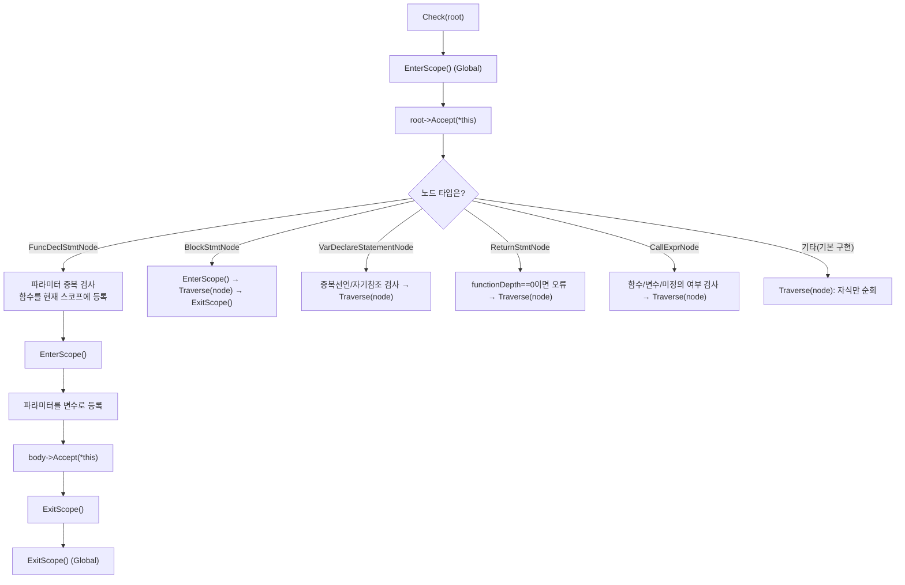

# CheckerUnit/ExecutorUnit Visitor 패턴 구조

`CheckerUnit`/`ExecutorUnit`이 `SyntaxNode::type`을 switch/if-chain으로 직접
분기하던 방식을, `SyntaxNode`를 추상 베이스 + `NodeType`별 구체 서브클래스로
나누고 `NodeVisitor`를 통한 더블 디스패치로 교체한 구조를 정리한다.

## 1. 클래스 구조 (SyntaxNode 계층 + NodeVisitor)

## 2. 더블 디스패치 흐름 (Accept → Visit)

## 3. CheckerUnit의 함수 체크 흐름

예: 방금 확인한 `ExitScope()`가 쓰이는 지점.

## 핵심 요약

- `SyntaxNode`는 추상 클래스, `NodeType`마다 구체 서브클래스(17종)가 존재한다.
- `Accept()`가 자기 타입을 정확히 알고 `NodeVisitor::Visit()`의 올바른
  오버로드로 되돌려준다 (더블 디스패치).
- `NodeVisitor`의 기본 `Visit()`는 `Traverse()`로 자식을 그대로 훑기만 한다
  → `CheckerUnit`/`ExecutorUnit`은 관심 있는 타입만 override하면 된다.
- `ExitScope()`는 `FuncDeclStmtNode`/`BlockStmtNode` override 안에서 스코프를
  열고 닫는 지점에 쓰인다.
